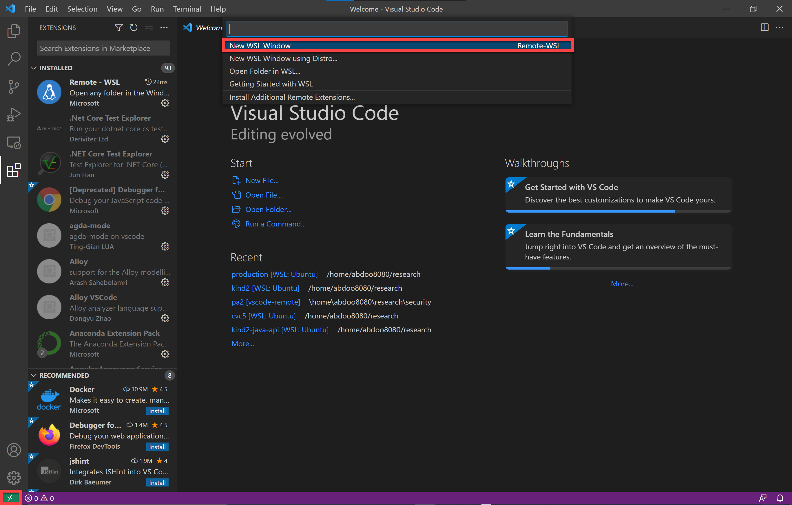

# Kind 2 Extension for VS Code
This extension provides basic support for Lustre programming language with Kind 2 annotations.

## Requirements
### Linux and MacOS
* Java 11+ run-time.
  * Debian-based Linux: `sudo apt install openjdk-17-jdk`
  * RHEL-based Linux: `sudo yum install java-17-openjdk`
  * MacOS: `brew install --cask temurin`
* ZeroMQ messaging library.
  * (Optional) Debian-based Linux: `sudo apt install libzmq3-dev`
  * (Optional) RHEL-based Linux: `sudo yum install libzmq3-devel`
  * MacOS: `brew install zmq`

  The `kind2` executable for Linux bundled with this extension is _statically_ linked against the ZeroMQ messaging library and does not require it to be installed in the system. Dynamically linked executables, however, *do* require the library to be installed in the system.

***Note:*** This extension only works with the latest nightly releases of `kind2` and does ***not*** support any current stable release.

### Windows
Windows is only supported through [WSL2](https://docs.microsoft.com/en-us/windows/wsl/about) (Windows 10 version 1903+ or Windows 11). WSL1 is not supported. Follow these steps to run the extension on Wsl2:
1. Install WSL
    * Windows 10 version 2004+ and Windows 11: Run `wsl --install` in PowerShell or Windows Command Prompt and restart your machine.
    * Windows 10 version 1903+: follow the manual steps in [this page](https://docs.microsoft.com/en-us/windows/wsl/install).
    2. Follow the instructions on [this page](https://docs.microsoft.com/en-us/windows/wsl/setup/environment#set-up-your-linux-user-info) to finish setting up your WSL2 Linux enviornment.
3. Install the [Remote - WSL](https://marketplace.visualstudio.com/items?itemName=ms-vscode-remote.remote-wsl) extension for VS Code.
4. Click on the green rectangle in the bottom-left corner of the VS Code window. A prompt will appear on the top. click on `new WSL window` to open.

5. Press `` Ctrl+Shift+` `` to open a Linux terminal on the new VS Code window. Use the terminal to install the Java run-time and the ZeroMQ messaging library (follow the instructions in the above section for your Linux distribution).
6. In the same VS Code window, go to the extension view in the activity bar to the left and lookup the `Kind 2` extension. Click `Install in WSL: <distro name>`.

Refer to [this page](https://docs.microsoft.com/en-us/windows/wsl/tutorials/wsl-vscode) to learn more about using WSL with VS Code.

## Main Features
* Syntax highlighting for Lustre and Kind 2 constructs.
* Document symbol outline.
  
* Syntax and type error reports.
  
* Model checking.
  
* Simulations.
  
* Counter-examples for falsified properties.
  
* Raw output of calling Kind 2 through the terminal.
  
