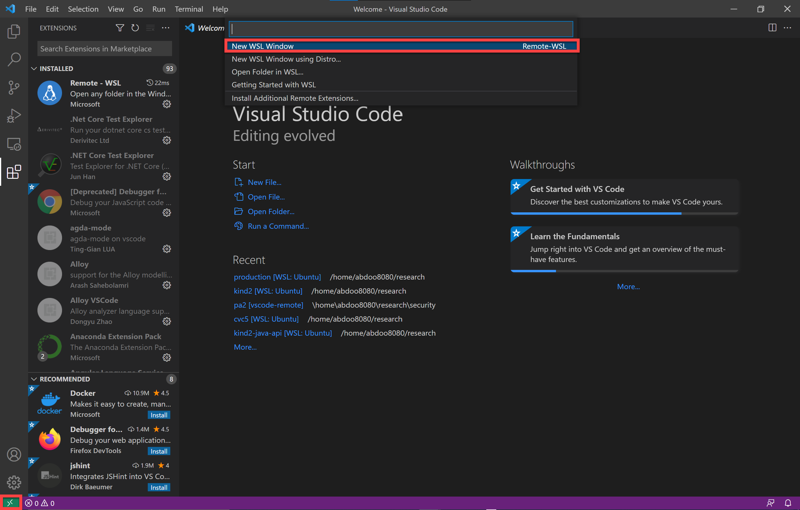
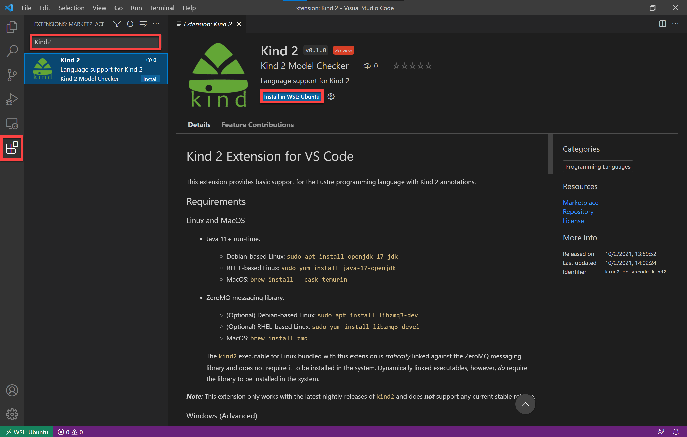
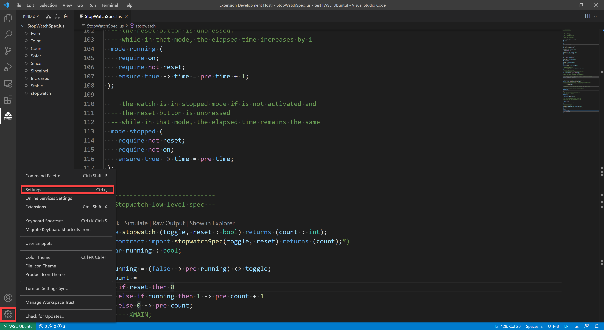
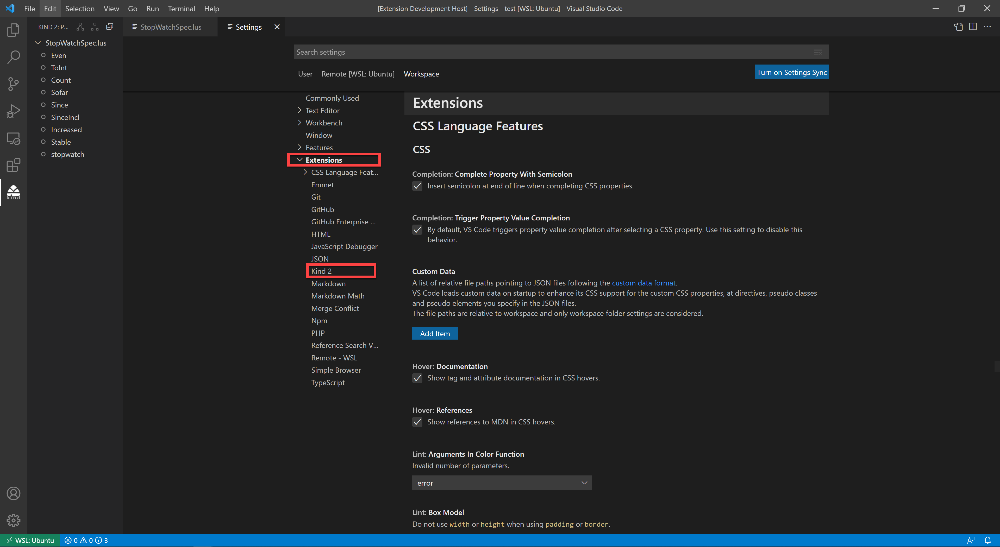
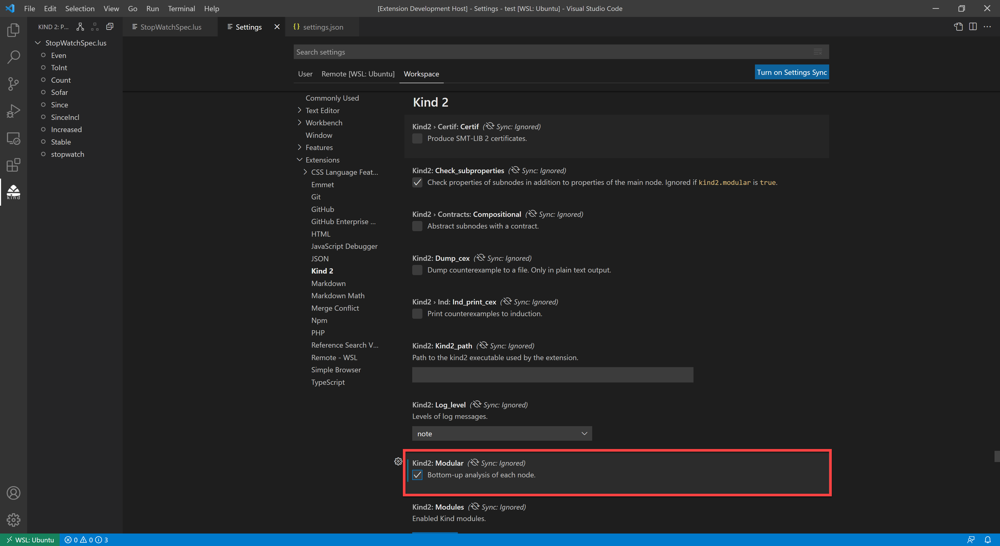
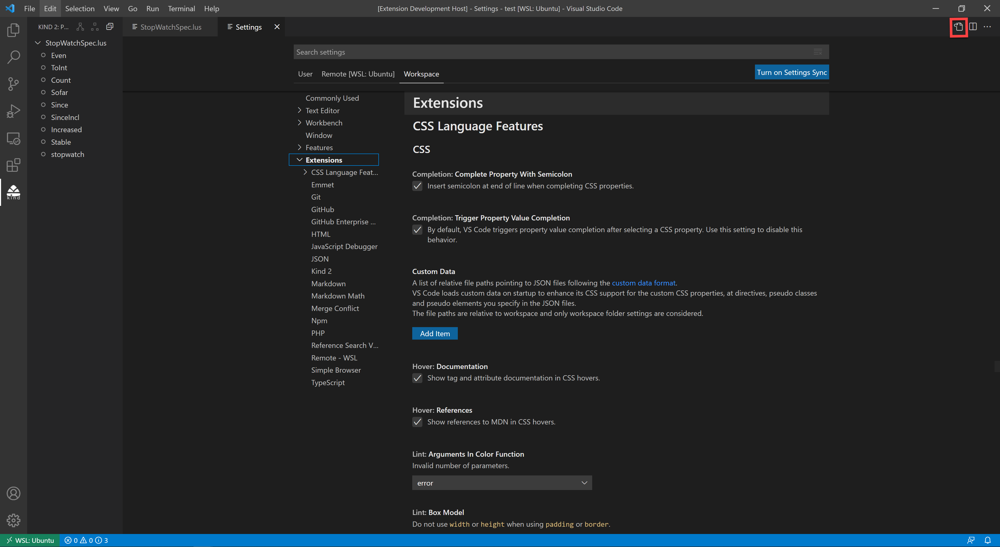
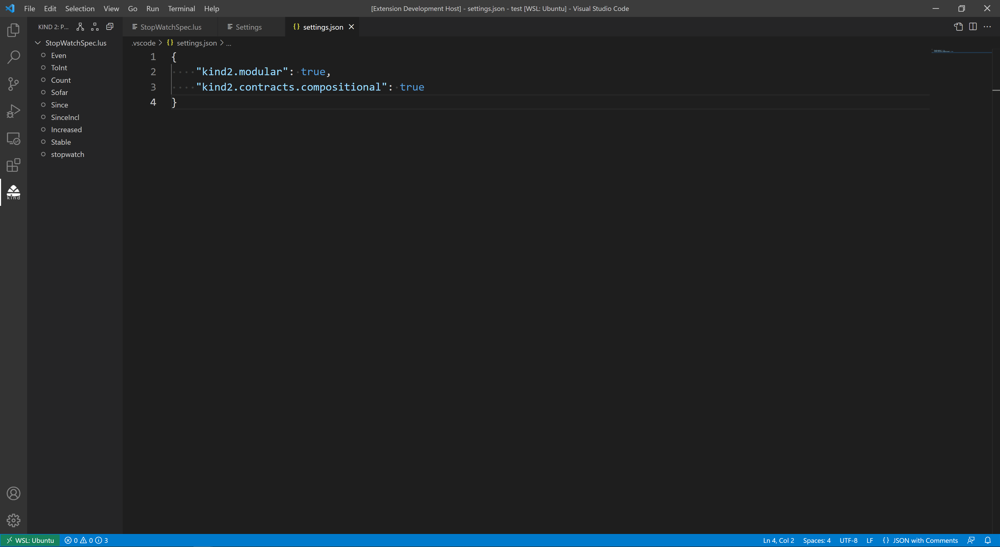
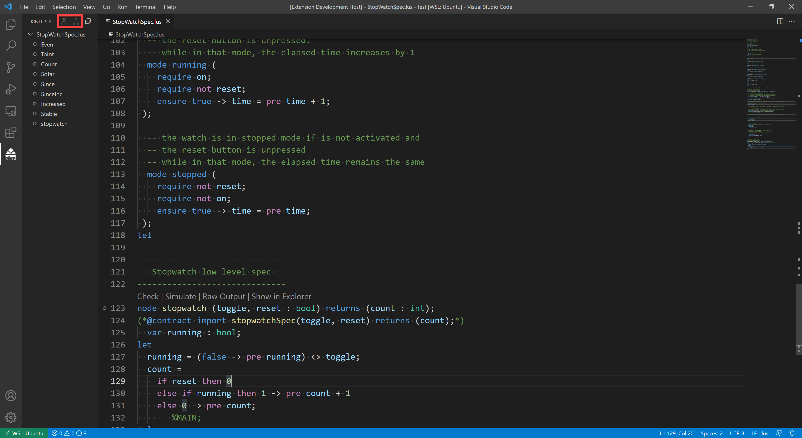

# Kind 2 Extension for VS Code
This extension provides basic support for the Lustre programming language with [Kind 2 Model Checker](https://kind2-mc.github.io/kind2) annotations.

## Requirements
Java 8+ run-time.
* Debian-based Linux: `sudo apt install openjdk-17-jdk`
* RHEL-based Linux: `sudo yum install java-17-openjdk`
* MacOS: `brew install --cask temurin`
* Windows: install a JDK from [Adoptium](https://adoptium.net/), or run `winget install EclipseAdoptium.Temurin.17.JDK`.

Since pre-release 0.15.0, Windows is supported natively; running the extension through
[WSL2](https://docs.microsoft.com/en-us/windows/wsl/about) is no longer required or supported.

### Windows through WSL2 (version 0.13.0 and earlier)
Running the extension inside WSL2 is required for version 0.13.0 and earlier, and uses the Linux build.
WSL1 is not supported. Follow these steps to run the extension on WSL2 (Windows
10 version 1903+ or Windows 11):
1. Install WSL
    * Windows 10 version 2004+ and Windows 11: Run `wsl --install` in PowerShell or Windows Command Prompt and restart your machine.
    * Windows 10 version 1903+: follow the manual steps in [this page](https://docs.microsoft.com/en-us/windows/wsl/install).
2. Follow the instructions on [this page](https://docs.microsoft.com/en-us/windows/wsl/setup/environment#set-up-your-linux-user-info) to finish setting up your WSL2 Linux environment.
3. Install the [Remote - WSL](https://marketplace.visualstudio.com/items?itemName=ms-vscode-remote.remote-wsl) extension for VS Code.
4. Click on the green rectangle in the bottom-left corner of the VS Code window. A prompt will appear on the top. click on `new WSL window`.

5. Press `` Ctrl+Shift+` `` to open a Linux terminal on the new VS Code window. Use the terminal to install the Java run-time.
6. In the same VS Code window, go to the extension view in the activity bar to the left and lookup the `Kind 2` extension. Click `Install in WSL: <distro name>`.

Refer to [this page](https://docs.microsoft.com/en-us/windows/wsl/tutorials/wsl-vscode) to learn more about using WSL with VS Code.

## Options
The extension supports modular and compositional analysis modes of Kind 2. Those modes are disabled by default. Follow the steps below to enable them (and other Kind 2 configurations):
1. Go to VS Code settings.
  
2. Click on Kind 2 under the Extensions section.
  
3. Enable modular, compositional, and/or other options.
  
4. If you prefer an editor interface, click on <span style="background-color: white"></span> icon at the top-right corner of the settings page to switch the JSON view:
  
5. Type `kind2`. VS Code will provide an autocompletion menu with available Kind 2 options. Select the options you want to configure and save your changes.
  

You can also enable/disable modular and compositional analysis modes from Kind's view. Click on their icons to enable them.


## Deploying the web workbench and LSP behind nginx

This project is split across three repositories:

- VS Code: the web workbench
- vscode-kind2: the custom VS Code extension
- kind2-language-server: the Java language server and WebSocket gateway

The deployment layout is:

- `https://kind.cs.uiowa.edu/app/` -> VS Code workbench
- `https://kind.cs.uiowa.edu/app/lsp` -> Kind 2 LSP WebSocket endpoint
- `https://kind.cs.uiowa.edu/kind2_user_docs/...` -> existing docs site

### Prerequisites

Install required tools:

```bash
sudo apt update
sudo apt install nginx
```

### 1) Clone required repositories

From a working directory such as `~/src`:

```bash
mkdir -p ~/src
cd ~/src

git clone https://github.com/microsoft/vscode.git
git clone https://github.com/kind2-mc/vscode-kind2.git
git clone https://github.com/kind2-mc/kind2-language-server.git
```

Set environment variables so the commands are portable. Set the variables to the actual location of each repository:

```bash
export VSCODE_DIR="$HOME/src/vscode"
export KIND2_EXT_DIR="$HOME/src/vscode-kind2"
export KIND2_LSP_DIR="$HOME/src/kind2-language-server"
```

### 2) Build the vscode-kind2 extension

From the extension repo:

```bash
cd "$KIND2_EXT_DIR"
npm ci
npm run esbuild-web
```

This compiles the web extension used by the VS Code web workbench.

### 3) Build the VS Code repo

Install dependencies:

```bash
cd "$VSCODE_DIR"
npm ci
```

When you want to launch the web app, use the launch command:

```bash
"$VSCODE_DIR/scripts/code-web.sh" \
  "$KIND2_EXT_DIR/src/web/lustre-examples" \
  --host 127.0.0.1 \
  --port 3000 \
  --browserType none \
  --extensionDevelopmentPath "$KIND2_EXT_DIR"
```

This starts the web app on port `3000` and loads the Kind 2 extension from the local clone.


### 4) Build the Kind 2 language server

The language server project has its own build system. 

```bash
cd "$KIND2_LSP_DIR"
./gradlew build
./gradlew install
```

### 5) Start the WebSocket LSP gateway

Note that in order to run the LSP in gateway mode, you must put the Kind 2 binary in the src/web/ directory in the LSP source code. The path of the Kidn 2 binary cannot be given by the web extension itself.

The gateway is the JS wrapper that forwards LSP traffic between the browser and the Java language server.

Start it from the language-server repo:

```bash
cd "$KIND2_LSP_DIR/src/web"
node kind2-gateway.cjs
```

This service listens on:

```text
ws://localhost:3001/lsp
```

### 6) Configure nginx SSL

Create a site file such as `/etc/nginx/sites-available/kind.cs.uiowa.edu` with the following contents. Remember to provide the paths to SSL certification files. For testing locally, replace `listen 443 ssl` with `listen 80`, add `localhost` or whichever host you want your server to listen to, and delete the two SSL path lines:

```nginx
map $http_upgrade $connection_upgrade {
  default upgrade;
  ''      close;
}

server {
  listen 443 ssl;
  server_name kind.cs.uiowa.edu;

  ssl_certificate {PATH_TO_CERTIFICATE}.pem;
  ssl_certificate_key {PATH_TO_PRIVATE_KEY}.pem;

  # Equivalent to ProxyPreserveHost On
  proxy_set_header Host $host;
  proxy_set_header X-Forwarded-Host $host;
  proxy_set_header X-Forwarded-Proto https;
  proxy_set_header X-Forwarded-For $proxy_add_x_forwarded_for;
  proxy_set_header X-Real-IP $remote_addr;

  # Equivalent to RewriteCond %{REQUEST_URI} =/app + redirect to /app/
  location = /app {
    return 302 https://$host/app/;
  }

  # docs app: Tomcat
  location /kind2_user_docs {
    proxy_pass http://127.0.0.1:8080;
  }

  # Route /app/lsp to the LSP backend.
  # This preserves Apache behavior that normalizes any /app/lsp... to /lsp
  location ~ ^/app/lsp(?:/.*)?$ {
    rewrite ^ /lsp break;
    proxy_http_version 1.1;
    proxy_set_header Upgrade $http_upgrade;
    proxy_set_header Connection $connection_upgrade;
    proxy_pass http://127.0.0.1:3001;
  }

  # code-web.sh generates root-relative /static/... URLs
  location /static/ {
    proxy_http_version 1.1;
    proxy_set_header Upgrade $http_upgrade;
    proxy_set_header Connection $connection_upgrade;
    proxy_pass http://127.0.0.1:3000/static/;
  }

  # Route /app/ to VS Code development server
  location /app/ {
    proxy_http_version 1.1;
    proxy_set_header Upgrade $http_upgrade;
    proxy_set_header Connection $connection_upgrade;
    proxy_pass http://127.0.0.1:3000/;
  }

  # fallback to Tomcat for everything else
  location / {
    proxy_pass http://127.0.0.1:8080;
  }
}
```

Enable the site and reload nginx:

```bash
sudo ln -s /etc/nginx/sites-available/kind.cs.uiowa.edu /etc/nginx/sites-enabled/kind.cs.uiowa.edu
sudo nginx -t
sudo systemctl reload nginx
```

### 7) Start the web app

Start the LSP gateway first:

```bash
cd "$KIND2_LSP_DIR/src/web"
node kind2-gateway.cjs
```

Then start the VS Code web app:

```bash
"$VSCODE_DIR/scripts/code-web.sh" \
  "$KIND2_EXT_DIR/src/web/lustre-examples" \
  --host 127.0.0.1 \
  --port 3000 \
  --browserType none \
  --extensionDevelopmentPath "$KIND2_EXT_DIR"
```

The site should now be available at:

```text
https://kind.cs.uiowa.edu/app/
```

and the LSP should be available at:

```text
wss://kind.cs.uiowa.edu/app/lsp
```


## Main Features
* Syntax highlighting for Lustre and Kind 2 constructs.
* Go-to-definition for top level declarations.
* Document symbol outline.
  
* Syntax and type error reports.
  
* Model checking.
  
* Simulations.
  
* Counter-examples for falsified properties.
  
* Raw output of calling Kind 2 through the terminal.
  
